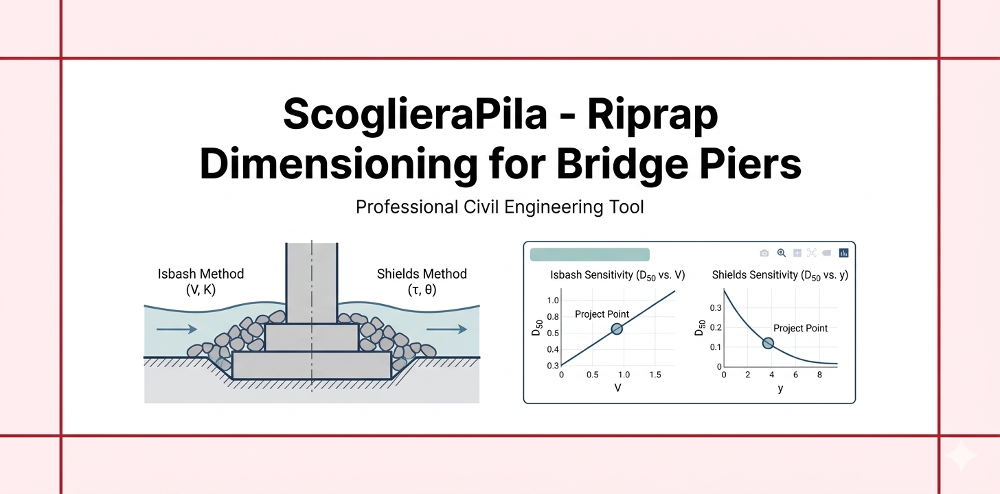

# ScoglieraPila – Dimensionamento scogliera di protezione pila da ponte


Web app professionale per il **dimensionamento preliminare della scogliera (riprap)**
a protezione di una **pila da ponte**, con i metodi Isbash e Shields.

## Stato attuale dell'implementazione

**v2 – completata** (ultima iterazione 2026-03-22)

Funzionalità implementate:
- DatiScogliera (dataclass frozen) con tutti i parametri di entrambi i metodi.
- valida_dati(): controllo completo per entrambi i metodi.
- d50_isbash(): `D50 = V² / (K²·g·(Ss-1))`.
- tau_fondo(): `τ = ρ·g·y·S` (alveo ampio).
- d50_shields(): `D50 = τ / (θ_c·(Ss-1)·ρ·g)`.
- calcola_d50(): dispatcher sul metodo selezionato.
- spessore_rivestimento(), larghezza_apron(): dimensioni geometriche dell'apron.
- massa_masso_tipico(): stima volume e massa del masso sferico equivalente (D = D50).
- calcola_report(): DataFrame con entrambi i metodi e dimensioni apron.
- curva_d50_vs_V(): sensitività Isbash su 50 punti.
- curva_d50_vs_y(): sensitività Shields su 50 punti.
- commenti_progettuali(): note su D50 elevato, velocità, Shields conservativo.
- app.py: layout wide, 4 metriche, 3 tab (Risultati / Grafici / Note), grafico
  sensitività Plotly con marcatura del punto di progetto, download CSV ×2.
- Input dinamici in sidebar in funzione del metodo selezionato.

## Struttura del progetto

```text
ScoglieraPila/
├── app.py           # UI Streamlit (nessuna formula)
├── src.py           # Isbash, Shields, apron, massa, sensitività, validazione, commenti
├── requirements.txt # streamlit, numpy, pandas, plotly
├── readme.md        # questo file
└── prompt.txt       # prompt per iterazioni future
```

## Input

| Parametro | Descrizione | Unità |
|-----------|-------------|-------|
| S_s | Densità relativa roccia ρ_s/ρ | – |
| ρ | Densità acqua | kg/m³ |
| ys_atteso | Scalzamento atteso (da app Scalzamento) | m |
| f_t | Fattore spessore apron | – |
| f_L | Fattore larghezza apron | – |
| V (Isbash) | Velocità caratteristica | m/s |
| K (Isbash) | Coefficiente Isbash | – |
| y (Shields) | Tirante | m |
| S (Shields) | Pendenza idraulica | – |
| θ_c (Shields) | Parametro critico di Shields | – |

## Output principali

- `D50 [m]` con il metodo selezionato (e confronto con l'altro metodo se dati disponibili)
- Spessore rivestimento `f_t·D50 [m]`
- Larghezza apron `f_L·ys [m]`
- Massa masso tipico `[kg]`
- Curva sensitività Plotly (D50 vs V o D50 vs y)
- CSV risultati e sensitività

## Flusso dati nella suite

```
App Scalzamento → ys_atteso → ScoglieraPila → D50 → ScoglieraFondazione
```

## Avvio rapido

```bash
pip install -r requirements.txt
streamlit run app.py
```

## Estensioni future consigliate

- Calcolo volume totale apron (richiede geometria pila in input)
- Classificazione granulometrica standardizzata (es. EN 13383)
- Verifica strato filtro granulare (regola di Terzaghi / Sherard)
- Confronto grafico Isbash vs Shields sullo stesso grafico
- Report PDF
